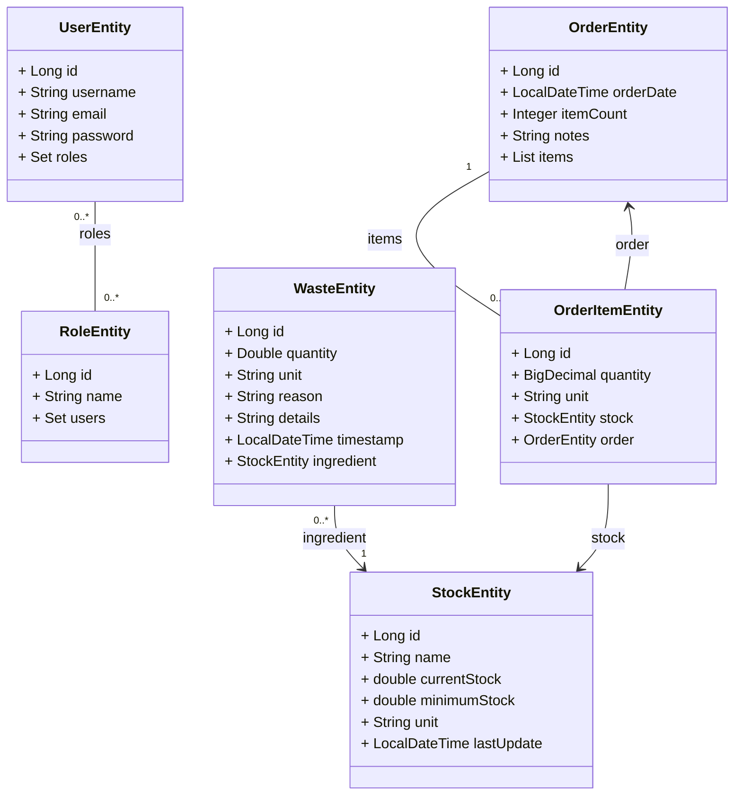
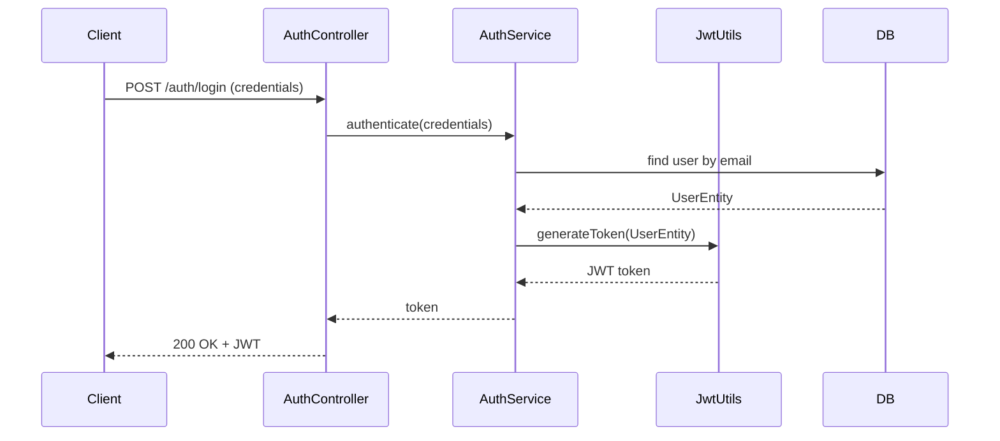
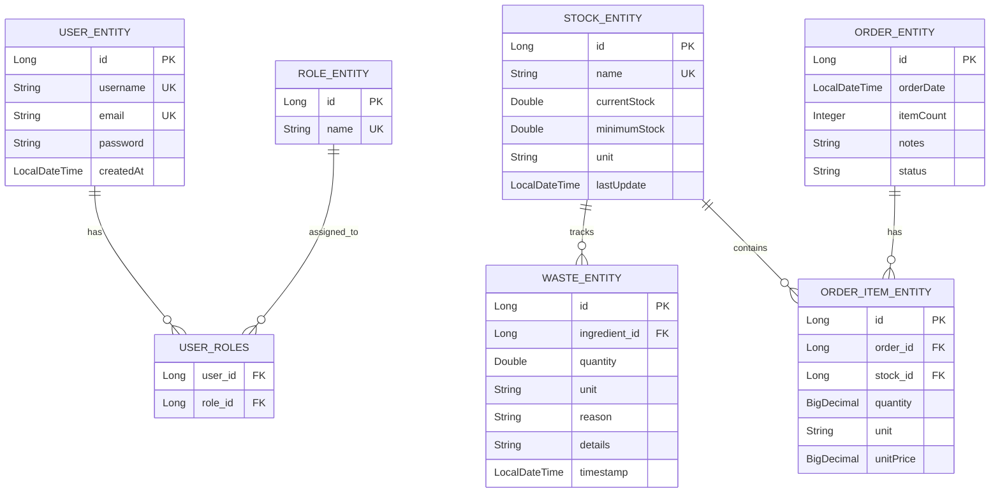

# Stockee. Backend

A RESTful API for inventory management, waste tracking, order recommendations, and analytics.  
Built with Spring Boot, JWT-based authentication, role-based access control, and JPA persistence.

---

## 1. Installation & run

Clone and run:

```bash
git clone <your-repo-url>
cd stockee_backend
./mvnw clean package
./mvnw spring-boot:run
```

Default app URL: `http://localhost:8080`  
Default API base path is controlled by `api-endpoint` (see configuration); examples below assume `api-endpoint=/api`.

### Run tests
```bash
./mvnw test
```

---

## 2. Configuration

Add to `src/main/resources/application.properties`:

```properties
api-endpoint=/api
jwt.key=your-very-secret-key-which-should-be-long-and-random

spring.datasource.url=jdbc:h2:mem:testdb
spring.datasource.driverClassName=org.h2.Driver
spring.datasource.username=sa
spring.datasource.password=
spring.jpa.hibernate.ddl-auto=update

spring.h2.console.enabled=true
spring.h2.console.path=/h2-console
```

**CORS** — default: `http://localhost:5173`

---

## 3. Architecture & packages

```
dev.paula.stockee_backend
├── auth
│   ├── AuthController.java
│   ├── AuthService.java
│   └── JwtUtils.java
├── config
│   ├── CorsConfig.java
│   ├── SecurityConfig.java
│   └── JwtAuthenticationFilter.java
├── analytics
│   ├── AnalyticsController.java
│   └── AnalyticsService.java
├── role
│   ├── RoleEntity.java
│   └── RoleRepository.java
├── user
│   ├── UserEntity.java
│   ├── UserRepository.java
│   └── UserService.java
└── StockeeBackendApplication.java
```

---

## 4. Diagram Class


---

## 5. Authentication Flow 



---

## 6. Entity Relationship Diagram



## 7. API

> Base path: `/api`

| Method | Endpoint | Auth | Description |
|--------|-----------|------|-------------|
| POST | `/api/register` | Public | Register a new user |
| POST | `/api/auth/token` | Basic | Get JWT token |
| GET | `/api/stock` | JWT | Get all stock items |
| POST | `/api/stock` | JWT | Create stock item |
| PUT | `/api/stock/{id}` | JWT | Update stock item |
| DELETE | `/api/stock/{id}` | JWT | Delete stock item |
| POST | `/api/waste` | JWT | Register waste |
| DELETE | `/api/waste/{id}` | JWT | Delete waste |
| GET | `/api/orders` | JWT | Get recommended orders |
| POST | `/api/orders` | JWT | Create new order |
| GET | `/api/analytics/stats` | JWT | Get analytics stats |

---

## 8. Security

- JWT tokens expire in 1 hour.
- Passwords encoded with BCrypt.
- Roles handled by `RoleEntity` (`USER`, `ADMIN`).
- `SecurityConfig` uses stateless JWT authentication.
- `api-endpoint` property allows configurable base path.

---

## 9. Test


---

## 10. Author

- **Paula** 

## Releated Projects 
- **Stockee Frontend** - [React Frontend Repository](https://github.com/Paulafrdz/stockee-frontend)


